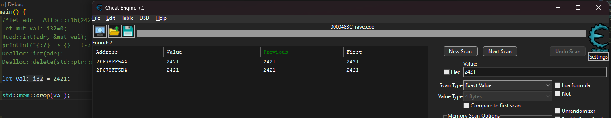

<h1 align="center">
   
  
   
  RAVE
   
</h1>

<h4 align="center">A Showcase of Rust Memory Analysis Evasion</h4>
<h5 align="center">Using Unsafe Memory Allocation to Prevent Value Leaks during Value Initialization</h5>

 RAVE deallocates the value and replaces the variable in the heap with a NULL opcode (`0x40`). 
  
 How Rust Drops Variables: 

## Features
- Allocation
- Deallocation
- Reading
- Variable Spoofing [ `Dealloc::delete()` ]

You can still overwrite values with `*adr = 5`.

## Usage

## License
[MIT]("LICENSE")

---
